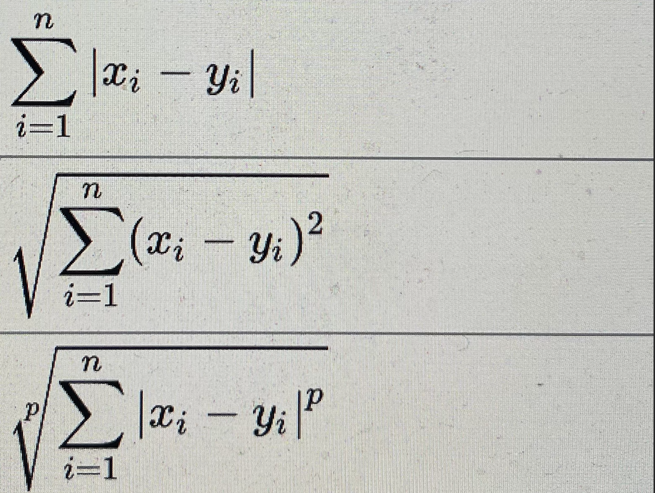

# Classe en Python

## Définition classe

En Python tout est objet.  

On définit une classe à l'aide du mot clé class. 

La classe est un objet et on crée une nouvelle instance de la classe en appelant celle-ci dans le code source.

La création d'une classe crée un espace de nommage de la classe, vous pouvez accéder à cet espace avec la fonction builtins vars de Python. 

Nous verrons que l'instance d'une classe crée également un espace de nommage, imaginez cela comme une bulle isolée dans le code qui encapsule les 
variables ou les attributs.

```python
class Hello:
    """
        message est attaché à la classe avant tout
        on peut y accéder depuis la classe
    """
    message = "Hello World"

    def getMessage(self):
        return self.message

# Création de l'instance de la classe Hello
h = Hello()

# Accès à la méthode 
print(h.getMessage())

# provoque une erreur, pas de self d'instance de la classe
Hello.getMessage()

```

## L'attribut name et self

L'attribut name que nous avons défini dans la classe Product est attaché à l'objet class dans l'exemple suivant, si nous modifions sa valeur à partir de la classe elle-même cela aura un impact sur toutes les instances de la classe Product :

```python

class Product:
    name = "Car"

p1 = Product()
p2 = Product()

Product.name = "Bike"

print(p1.name) # Bike
print(p2.name) # Bike

```

Afin de pouvoir avoir un nom spécifique pour chaque produit il est donc préférable de créer une méthode qui créera un attribut name pour l'instance :

```python

class Product:

    # variable lié à la classe et non à l'instance
    productId = "123"

    # le premier argument self représente l'instance de la classe
    def setName(self, name):
        # sera définit que si on appelle la méthode setName
        self.name = name

Product.productId = "321"
p1 = Product()
p1.setName("Car")

p2 = Product()
p2.setName("Bike")

print(p1.name) # Car
print(p2.name) # Bike

print(p1.productId)
print(p2.productId)
```

## Le constructeur de la classe ~ initialiser des valeurs à l'instanciation

Un constructeur est une méthode spéciale, pré-définit par Python, que vous pouvez écrire dans la classe, elle permet d'initialiser des valeurs à vos attributs à l'instanciation de la classe, cette méthode sera appelée automatiquement à l'instanciation de la classe :

```python

class Hello:

    def __init__(self, message):
        self.message = message

h = Hello("Hello World!")
print(h.message) # retourne Hello World!

```

Vous pouvez également passer plusieurs valeurs à l'instanciation de votre classe, pour initialiser plusieurs attributs de l'instance :

```python

class Hello:

    # un deuxième paramètre facultatif
    def __init__(self, message, language = 'fr', id = 10):
        self.message = message
        self.language = language
        self.id = id

h = Hello("Hello World!", 'en')
print(h.message) # affichera Hello World!

h2 = Hello("Bonjour le monde")
print(h2.message) # affichera Bonjour le monde
```

On a les attributs nommées 

```python
 h = Hello(message = "n", id = 1000 )
 h.id # 1000
 ```

## Méthodes privées d'une classe

Il n'y a pas de propriété privée en Python, on adopte classiquement la convention suivante pour spécifier que ces attributs sont privés : prefixer le nom des propriétés par un enderscore.

Par convention les méthodes privées en Python seront préfixées par un/deux enderscores.


### Setter et getter en Python

Vous pouvez également définir des getter et setter en Python en utilisant la propriété property ( c'est un décorateur Python, nous les verrons en détails un peu plus tard dans le cours ).

```python
class A:
    def __init__(self):
        self._x = None

    @property
    def x(self):
        return self._x

    @x.setter
    def x(self, value):
        self._x = value

    @x.deleter
    def x(self):
        del self._x
```

## 001 Exercice Product

Créez une classe Product avec name et price. Créez le setters et getter uniquement pour le prix comme vu précédement afin de données valeurs à vos objets de type Product (hydratation des objets).

Cette classe aura un attribut attaché à la classe qui définiera sa tva.

Créez deux produits apple et orange respectivement avec les prix HT suivants : 1.2 et 1.1, la tva sera de 20%. 

Affichez le prix de chaque produit et faites la sommes des deux produits.

## 002 Exercice que fait ce programme ? (à ne pas réviser)

Faites une instance de la classe MappingSubclass, est une classe qui hérite de Mapping

```python
class Mapping:
    def __init__(self, iterable):
        self.items_list = []
        self.__update(iterable)

    def update(self, iterable):
        for item in iterable:
            self.items_list.append(item)

    __update = update

# héritage de la classe Mapping 
class MappingSubclass(Mapping):

    # surcharge le comportement de la méthode update de la classe mère
    def update(self, keys, values):
        for item in zip(keys, values):
            self.items_list.append(item)

mapSub = MappingSubclass("Bonjour")
```

## Arbre d'héritage entre classe et objet

Python définit ce que l'on appelle un arbre d'héritage entre la classe et l'instance de la classe. Si vous regardez l'espace de nommage de la classe et de l'instance alors l'espace de nommage à la différence de la classe est vide. Cet espace sera rempli par les méthodes et les attributs que l'on définiera dans la classe elle-même.


### Exemple concret du principe d'arbre d'héritage

```python
class Hello:
    """A simple example class"""
    message = "Hello World"

    def getMessage(self):
        return self.message

# ajout à la classe
Hello.words = Hello.message.split()

# instance
h = Hello()

print(h.words)
# ['Hello', 'World']

# Vous pouvez également appeler la méthode getMessage comme suit (moins intuitif)
# En passant l'instance de la classe à la méthode
Hello.getMessage(h)

print(Hello.__mro__)
# __main__.Hello, object)
```

*La classe Hello abstraite hérite de la classe object.*

- Espace de nommage de l'objet

Si on ajoute une méthode/attribut à la classe alors l'espace de nommage de l'objet est modifié (une nouvelle méthode est ajoutée à ce dernier). 
Nous allons préciser la définition de méthode par la suite. 

```python
vars(Hello)
```

Vous avez une fonction vars qui vous permet de visualiser ce principe dans le script.

## Comportement <=> méthode

Dans une classe on définit ce que l'on appelle des **comportements**, ou méthodes, ce sont des fonctions Pythons implémentées dans la classe.

Lorsqu'on appelera la méthode sur une instance de la classe, Python référencera cette instance à l'aide du mot clé **self**, c'est l'instance de la classe. 

Le mot self est un mot arbitraire vous pourriez utiliser un autre mot, mais la convention est l'utilisation du mot **self**.

## Méthodes spéciales

Vous pouvez implémenter des comportements spécifiques à l'instanciation de la classe à l'aide de la méthode suivante :

```python
class Dog:
    # Cette variable sera partagée par toutes les instances propre à la classe donc pas à l'instance
    kind = 'canine'

    # Définition des variables de classe
    def __init__(self, name):
        self.name = name    
```

Notez qu'une variable définie avant la méthode d'initialisation sera attachée à la classe elle-même.

On peut implémenter des méthodes **spéciales** dans une classe pour utiliser par la suite des fonctions **builints** comme **len**, ou des opérateurs d'appartenance comme **in**... Voyez l'exemple suivant nous avons défini des comportements 


```python

class Message:

    """
    définit l'initialisateur de la classe les variables de classe
    """
    def __init__(self, message):
        self.message = message 

    """
    pour le symbole de l'appartenance in 
    """
    def __contains__(self, word):
        return word in self.message 

    """
    longueur
    """
    def __len__(self):
        return len(self.message)

    def __str__(self):
        print(self.message)

    def __add__(self, other):
        return self.message + " " + other.message
```

Voici comment vous pouvez utiliser maintenant dans le script courant ces comportements :

```python

m1 = Message("Bonjour")
m2 = Message("tout le monde")

# Donne une chaine de caractères
message = m1 + m2

"Bonjour" in m1
# True
"tout le monde" in m1
# False

# Vous pouvez également faire un print maintenant sur votre objet
print(m1)

# Un len également
len(m1)
```

### 01 Exercice Parse

Créez une classe Parse, soit la chaîne de caractères suivantes, utilisez les fonctions strip() et split() pour retournez une structure 
comportant uniquement des numériques, vous testerez votre méthode sur la chaîne suivante :

```python

phrase = '8790: bonjour le monde:8987:7777:Hello World:    9007' 

p = Parser(':', phrase)
print( p )
# 8790 8987 7777 9007
```

## Introduction à l'Héritage

Une classe  hérite d'une super-classe et un objet hérite de sa classe, cela forme un arbre d'héritage. 

Attention, lorsque vous faites de l'héritage vous devez appliquer le principe fondamental suivant : une classe qui hérite d'une super-classe doit être une sorte de ou est un par rapport à sa super-classe. 

Par exemple si vous avez une super-classe Animal vous aurez certainement une classe spécialisée Mamifere. Ici la classe Mamifere est 
une sorte de ou est un Animal. Le principe est donc vérifié.


### Exemple Héritage

Vous pouvez surcharger une méthode d'une super-classe dans une classe héritant de cette dernière. 

Dans ce cas la classe fille utilisera sa nouvelle méthode à la place de la méthode de la classe mère, bien sûr vous pouvez accéder à une méthode définie dans la super-classe depuis la classe fille :

```python
class Model:

    """
    définit l'initialisateur de la classe les variables de classe
    """
    def __init__(self, tableName):
        self.tableName = tableName 

    def __len__(self):
        return len(self.tableName)

# La class Post hérite de la classe Model
class Post(Model):
    # On surcharge la méthode spéciale 
    def __len__(self):
        return len(self.tableName) + 1

p = Post("post")
len(p) # 5
```

### 02 Exercice Héritage

Ecrire une classe Message qui permet de définir un message à l'aide de son constructeur et une classe Formatted_Message. Celle-ci hérite de la classe Message. 

Les deux classes auront la méthode spéciale **contains** l'une testera l'appartenance d'un mot dans la chaîne en considérant la casse du message et l'autre (classe qui hérite de la classe Message) testera l'appartenance d'un mot dans la chaîne sans considération sur la casse du message.

## La classe object

Précisons pour la suite du cours que toute classe hérite de la classe object en Python, pour s'en convaincre il suffit de taper 
le code suivant qui indique les classes héritées par une classe donnée :

```python
class A:
    pass

# La classe A hérite de la classe object.
print(A.__bases__)

class B(A):
    pass

print(B.__bases__)
```

### 03 Exercice HasCap 

Ecrire une classe HasCap qui lorsqu'on renvoie tous les mots/particules d'un texte t commençant par une majuscule dans un dictionnaire en comptant le nombre d'occurence de ces mots/particules.

```python

phrase = "Le langage Python est placé sous une licence libre proche de la licence BSD6 et fonctionne sur la plupart des plates-formes informatiques, des smartphones aux ordinateurs centraux7, de Windows à Unix avec notamment GNU/Linux en passant par macOS, ou encore Android, iOS, et peut aussi être traduit en Java ou .NET. Il est conçu pour optimiser la productivité des programmeurs en offrant des outils de haut niveau et une syntaxe simple à utiliser."

hasCap = HasCap(phrase)

print(hasCap.parse())
# {'Le': 1, 'Python': 1, 'BSD6': 1, 'Windows': 1, 'Unix': 1, 'GNU/Linux': 1, 'Android,': 1, 'Java': 1, '.NET.': 1, 'Il': 1}
```

## 04 Distance euclidienne

Remarque générale : pensez à importer le module math de Python dans vos scripts pour cet exercice. Voyez également la notion de distance à la fin de l'exercice dans la partie indications.

1. Créez une classe Distance qui calcule la distance entre deux points représentés sous forme d'un objet.

```python
# Définition des points
A = Point(5, 7)
B = Point(15, 1)

# Calcule de la distance
print(Distance(A,B).euclidean())
```

2. Créez une deuxième classe dans un autre fichier, cette classe possèdera une méthode qui calculera la moyenne des distances par rapport à un centroïd.

```python
centroid = Point(3, 7)
A = Point(5, 7)
B = Point(7, 1.3)
C = Point(10, 11)
D = Point(0.9, 11)
E = Point(3, 8)

distance = DistanceAverage(A, B, C, D, E)

print(distance.euclidean(centroid))
```

3. Modifiez cette dernière classe pour changez facilement de norme. Vous pouvez utiliser une lambda par exemple.

Indications, ci-dessous les distances absolue, euclienne et Minkowski pour les points suivants A et B

A(x1, x2, ..., xn)
B(y1, y2, ..., yn)



Pour calculer la distance entre deux points, on appliquera la définition suivante, en définissant A(x, y) et B(x, y)

```python
import math as m

class Point:
    pass

A = Point(x=1, y=2)
B = Point(x=2, y=3)

"""
d =m.sqrt( (A.x - B.x)**2 + (A.y - B.y)**2 )
"""
```

## 05 Matrice GenerateMatrix

Vous devez définir une classe métier bien structurée et réutilisable

1. Créez une classe qui génère une matrice quelconque n,p où n et p sont les dimensions de la matrice.

2. Définissez un nouveau comportement à votre classe, shuffle, cette méthode mélangera les lignes de la matrice.

```python
m = GenerateMatrix(7,8)

m.Matrix

"""
[[37, 7, 74, 43, 12, 92, 6, 19],
 [7, 57, 2, 84, 33, 41, 23, 76],
 [36, 40, 87, 42, 80, 36, 43, 58],
 [71, 49, 31, 53, 53, 25, 72, 8],
 [95, 86, 90, 67, 30, 4, 16, 64],
 [27, 90, 43, 25, 47, 8, 31, 93],
 [48, 83, 98, 51, 5, 21, 27, 46]]
 """

 m.shuffle()

 """
 [[48, 83, 98, 51, 5, 21, 27, 46],
 [95, 86, 90, 67, 30, 4, 16, 64],
 [37, 7, 74, 43, 12, 92, 6, 19],
 [27, 90, 43, 25, 47, 8, 31, 93],
 [36, 40, 87, 42, 80, 36, 43, 58],
 [7, 57, 2, 84, 33, 41, 23, 76],
 [71, 49, 31, 53, 53, 25, 72, 8]]
 """
 ```
