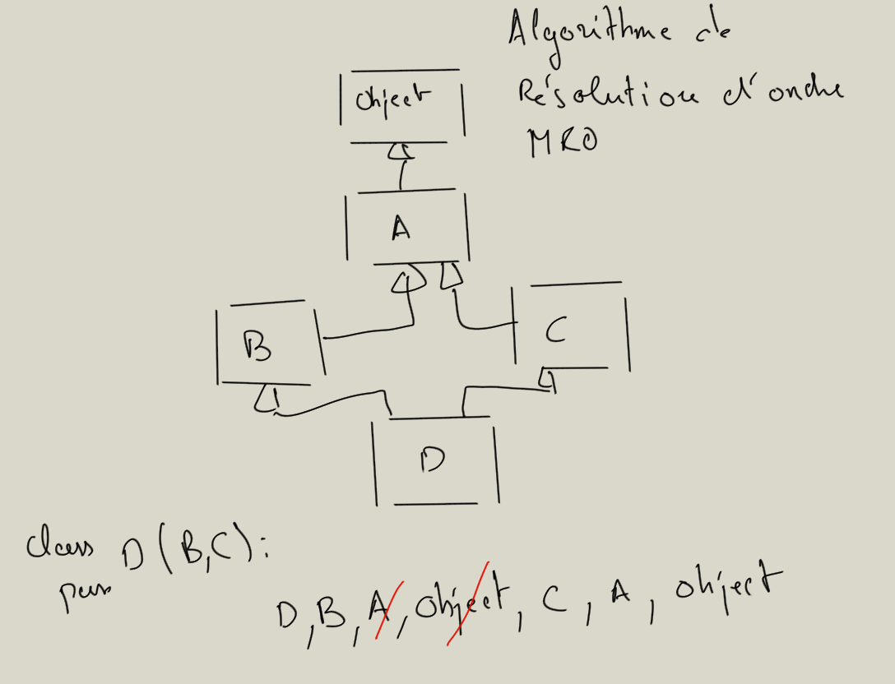

# Héritage complément

## Quelques fonctions utiles

### issubclass

Cette fonction permet de vérifier qu'une classe est une sous-classe d'une autre classe.

```python

class Product:

    def __init__(self, name, price, tva = .2):
        self.name = name
        self.price = price
        self.tva = tva

# héritage
class Bike(Product):
    pass

print(issubclass(Bike, Product)) # True
print(issubclass(Product, Bike)) # False

print(issubclass(Product, object)) # True

```

### isinstance

Cette fonction permet de savoir si un objet est issu d'une classe ou de ses classes filles.

```python

print(isinstance(b, Product)) # True
print(isinstance(b, Bike)) # True

print(isinstance(b, object)) # True

class Model:
    pass

print(isinstance(b, Model)) # False

```

## Héritage Multiple et Algorithme MRO ~ résolution de recherche des attributs

Python possède un mécanisme de résolution d’ordre pour la recherche des attributs d'une classe dans l’héritage multiple appelé MRO (Method, Resolution, Order).

L’ordre est déterminé par rapport à l’ordre dans lequel vous écrivez les classes héritées, voyez l'exemple suivant :

```python

# Arbre héritage MRO
class superA:
    pass

class superB:
    pass

# Héritage multiple
class normalA(superA, superB):
    pass

print(normalA.mro())
# [<class '__main__.normalA'>, 
# <class '__main__.superA'>, 
# <class '__main__.superB'>, 
# <class 'object'>]

# Différent de la classe suivante
class normalB(superB, superA):
    pass

print(normalB.mro())
# [<class '__main__.normalB'>,
#  <class '__main__.superB'>, 
# <class '__main__.superA'>, 
# <class 'object'>]

```

Si vous utilisez super() dans le contexte d'héritage multiple dans ce cas super() se référencera à la première classe rencontrée dans l'algorithme MRO :

```python

class superA:
    def __init__(self):
        print("superA")

class superB:
    def __init__(self):
        print("superB")

# Héritage multiple
class normalA(superA, superB):
    def __init__(self):
        super().__init__()

normalA() # affichera superA

```

Si vous inversez l'ordre des classes dans la classe normalA alors cela changera l'ordre de la MRO, ainsi :

```python

# Héritage multiple
class normalA(superB, superA):
    def __init__(self):
        super().__init__()

normalA() # affichera superB

```

## Précision sur l'algorithme MRO

Voici une idée de l’algorithme MRO qui permet de définir l’arbre de résolution.

Dans l’exemple ci-dessous on part de D, puis on remonte vers B puis une fois en haut de l’arbre on repart de C pour remonter. Puis on barre les premiers objets répétés dans l’arbre. Ainsi on détermine le mécanisme de résolution de recherche des méthodes dans l’arbre :

résumé de l'algorithme : parcours de bas en haut et de gauche à droite, et si classes dupliquées on les barre et on garde la dernière.

